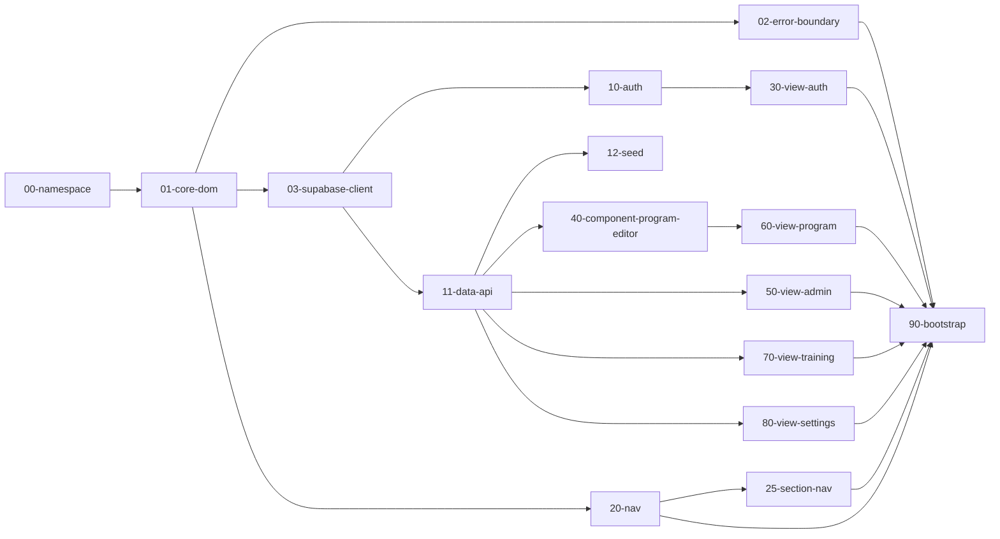

# Architecture — TMB Summer Book

> Documentation technique de référence : découpage en modules,
> mécanisme d'isolation des pannes, flux de données. Pour une
> présentation grand public de l'app, voir le `README.md` à la racine.
> Pour la sécurité, voir `docs/SECURITY.md`.

---

## 1. Vue d'ensemble

L'app est un site statique **vanilla JS** (aucun framework, aucun
bundler, aucun build) déployé tel quel. Toutes les données passent par
**Supabase** (Auth + Postgres + Row Level Security) via
`@supabase/supabase-js` chargé depuis un CDN.

Depuis le 08/07/2026, le code JS n'est plus un seul fichier
`assets/app.js` mais **16 modules indépendants** sous `assets/js/`,
chargés comme autant de balises `<script>` classiques (pas de modules
ES — voir §4 pour la justification). L'ancien fichier unique est
archivé dans `legacy/app.monolithic.js`.

**Pourquoi ce découpage ?** Pour que le code soit plus facile à
comprendre module par module, et surtout pour qu'**un bug dans un
module n'empêche pas les autres de fonctionner** — par exemple, une
erreur dans la section Programme ne doit pas empêcher un Admin d'ouvrir
la section Admin, ni casser le bouton de déconnexion.

Depuis le 10/07/2026, l'app est organisée par **sections** plutôt que
par rôle : Entraînement, Programme, Admin, Profil (voir §2 et §3). Un
même rôle peut voir plusieurs sections (ex. un coach voit Entraînement +
Programme + Profil), et une même section peut servir plusieurs rôles
(ex. la section Programme sert admin ET coach, avec des droits d'écriture
différents — voir §6). La barre de navigation (`25-section-nav.js`)
affiche uniquement les sections pertinentes pour le rôle courant.

---

## 2. Arbre des fichiers (annoté)

```
assets/
  js/
    00-namespace.js                  Squelette window.TMB — doit rester trivial
    01-core-dom.js                   Aides DOM génériques, libellés partagés
    02-error-boundary.js             Isolation de panne : safeRender() + filet global
    03-supabase-client.js            Client Supabase unique, garde-fou de config
    10-auth.js                       Inscription / connexion / déconnexion
    11-data-api.js                   CRUD programme (catégories/profils/plans/jours/exercices/validations)
    12-seed.js                       Import des données par défaut (default_program.json)
    20-nav.js                        Affichage des conteneurs de vue + topbar (doit rester minimal)
    25-section-nav.js                Navigation entre sections (Entraînement/Programme/Admin/Profil), desktop + mobile
    30-view-auth.js                  Écran de connexion / inscription
    40-component-program-editor.js   Éditeur de programme partagé (section Programme), bibliothèque d'exercices
    45-component-timer.js            Chronomètre / minuteur partagé (page dédiée d'un exercice)
    50-view-admin.js                 Section Admin (gestion des comptes)
    60-view-program.js               Section Programme (édition + stats de régularité) — admin/coach
    70-view-training.js              Section Entraînement (semaine, jour, page dédiée par exercice) — tout rôle avec catégorie
    80-view-settings.js              Section Profil (identifiant, catégorie, mot de passe, déconnexion, thème) — tous rôles
    90-bootstrap.js                  Démarrage, session, dispatch vers la section d'atterrissage par rôle
    README.md                        Résumé condensé de cette page, au plus près du code
  style.css                          Design system "Sportif & Aéré" — une seule feuille,
                                      tokens (couleurs/espacements/rayons/ombres) en haut
  supabase-config.js                 URL + clé anon Supabase
  default_program.json               Données d'amorçage (5 semaines × 4 catégories × jours)
  logo.svg
design/
  index.html                        Catalogue de tous les composants visuels, sans
                                      connexion/Supabase requis — voir §7
docs/
  ARCHITECTURE.md (ce fichier) + .docx
  SECURITY.md + .docx
security/
  Scripts de test des policies RLS — voir docs/SECURITY.md §6
tests/
  e2e/                                Tests Playwright de non-régression
supabase/
  schema.sql                        Schéma complet (tables + RLS + triggers)
legacy/
  app.monolithic.js                  Ancienne version pré-découpage (archivée, non chargée)
  data.js, cloud.js                  Version v1 (localStorage, sans compte)
index.html                          Coquille HTML + liste ordonnée des 16 scripts
README.md                           Présentation générale, grand public
```

---

## 3. `window.TMB` — l'espace de noms partagé

Sans bundler, les modules doivent pouvoir s'appeler entre eux sans
polluer l'espace global. Chaque fichier est une IIFE
(`(function(){"use strict"; ...})()`) qui n'attache que ses exports
volontaires à `window.TMB` :

```js
window.TMB = {
  core: {},        // $, $$, el, escapeHtml, toast, ageFromBirthDate,
                    // fullName, ROLE_LABELS, DAY_LABELS
  errors: {},        // safeRender, showErrorCard, logError
  state: {             // état partagé — toujours lu "en direct", jamais copié
    session: null,
    profile: null,
    categories: [],
    currentSection: null // "training" | "program" | "admin" | "settings" | null
  },
  supabase: { client: null, ready: false },
  auth: {},              // signUp, signIn, signOut, adminCreateAccount, updatePassword
  data: {},               // tout le CRUD + seedDatabase (dont updateProfileFields, checkUsernameAvailable)
  nav: {},                 // showView, renderTopbar, renderSectionNav
  components: { programEditor: {}, timer: {} },  // mount() partagés (éditeur de programme, chronomètre)
  views: { auth: {}, training: {}, program: {}, admin: {}, settings: {} },
  bootstrap: {}                          // handleSessionChange, init
};
```

**Règle** : chaque fichier n'écrit que dans sa propre "case" du
namespace (documenté dans le tableau de `assets/js/README.md`). Deux
fichiers qui écriraient dans la même case s'écraseraient silencieusement
— ce n'est pas détecté automatiquement, c'est une discipline de code.

**État partagé (`TMB.state`)** : `session`, `profile`, `categories`
sont lus **en direct** (`TMB.state.profile.role`, jamais copiés dans
une variable locale qui pourrait devenir périmée après un changement de
session).

---

## 4. Pourquoi des scripts classiques, pas des modules ES ?

Un script classique (`<script src="...">`) qui échoue au chargement ou
lève une erreur à l'exécution **n'empêche pas** le script suivant de se
charger et de s'exécuter — le navigateur traite chaque balise
`<script>` comme un job indépendant. C'est la base du mécanisme
d'isolation décrit au §5.

Les modules ES (`<script type="module">`) ont la même propriété
d'exécution indépendante, mais construisent un vrai graphe d'`import`.
Comme cette app n'a pas besoin d'un graphe d'imports explicite (tout
passe par `window.TMB`), les modules ES n'apportent rien ici et
ajoutent une contrainte inutile (nécessite d'être servi en http(s), pas
en `file://`). On reste donc sur des scripts classiques, qui prolongent
directement ce que l'app faisait déjà avant ce découpage.

---

## 5. Isolation des pannes — ce que ça protège, et ce que ça ne protège pas

### Le mécanisme

1. **Chargement** : 16 balises `<script>` séparées. Si un fichier a une
   erreur de syntaxe ou lève une exception à son chargement, les
   fichiers suivants se chargent quand même.
2. **Rendu** : chaque section top-level (`auth`, `training`, `program`,
   `admin`, `settings`) est rendue via `TMB.errors.safeRender(moduleName,
   () => ..., containerSelector)`, dans `90-bootstrap.js` (atterrissage)
   et `25-section-nav.js` (changement de section). Une erreur (synchrone ou
   promesse rejetée) à l'intérieur affiche une carte d'erreur **dans le
   conteneur de cette vue uniquement** (`.error-card`, voir
   `assets/style.css`) au lieu de planter toute la page.
3. **Filet global** : `window.addEventListener('error' |
   'unhandledrejection', ...)` dans `02-error-boundary.js` logge tout ce
   qui échapperait au point 2 (ex. un gestionnaire d'événement non
   protégé), sans tenter de ré-afficher quoi que ce soit (contexte trop
   incertain).

La **topbar** (nom + badge de rôle, `20-nav.js`) reste rendue en dehors
de tout `safeRender` de vue : elle s'affiche même si l'écran en dessous
est cassé. Ce n'est en revanche plus vrai pour la **déconnexion** et
l'**interrupteur de thème**, tous deux déplacés dans la section Profil
(`80-view-settings.js`, un choix produit délibéré — la topbar reste
épurée). Ils héritent donc du filet `safeRender` de CETTE vue : si le
module Profil plante, ils deviennent inaccessibles depuis l'UI (il
reste possible de vider le storage du navigateur pour se déconnecter).
Le principe général tient toujours pour le reste : une panne dans
Entraînement/Programme/Admin ne bloque jamais l'accès à Profil.



### Piège technique évité : l'appel en "thunk"

`safeRender` est toujours appelé avec une fonction anonyme :

```js
safeRender("training", () => TMB.views.training.render(), "#view-training");
```

et jamais avec la référence directe (`TMB.views.training.render`). Avec
la forme directe, si `TMB.views.training` n'existait pas encore (namespace pas
prêt), l'erreur se produirait **en évaluant l'argument**, donc *avant*
d'entrer dans le `try` de `safeRender` — elle ne serait alors pas
capturée. Avec la forme `() => ...`, cette même erreur se produit *à
l'intérieur* de l'appel à `renderFn()`, donc bien dans le `try`.

### Ce que ça NE protège PAS

Tous les modules partagent le même `window` / la même exécution JS —
ce n'est **pas** une sandbox comme une iframe ou un Web Worker :

- Un module peut corrompre `TMB.state` ou écraser silencieusement une
  clé du namespace utilisée par un autre module (collision de nom) —
  rien ne le détecte automatiquement.
- Une boucle infinie synchrone dans un module gèle l'interface pour
  tout le monde ; `safeRender` ne peut rien contre ça (le code n'a
  jamais l'occasion de lever une exception ni de rendre la main).
- `03-supabase-client.js` qui échoue (configuration manquante) est
  traité comme un **pré-requis bloquant**, pas comme "une panne de
  module" — toute l'app s'arrête avec un message clair
  (`.boot-error`), volontairement, plutôt que de laisser d'autres
  modules essayer de fonctionner sans client Supabase.

---

## 6. Contrat du composant partagé : l'éditeur de programme

`TMB.components.programEditor.mount(container, opts)` — utilisé par
`60-view-program.js` (onglet "Éditer" de la section Programme, pour
admin et coach).

```js
mount(container, {
  categoryId,          // id de catégorie affichée au départ
  week,                // numéro de semaine initial (1 à 5)
  allowedCategories,    // catégories sélectionnables (null = toutes)
  lockCategory           // true = pas de sélecteur de catégorie
})
```

Le composant décide lui-même, catégorie par catégorie, si l'utilisateur
courant peut éditer (`canEditCategory()` interne, basé sur
`TMB.state.profile`) : un admin peut toujours, un coach seulement pour
sa propre catégorie assignée. Sans droit d'écriture, l'affichage bascule
automatiquement en lecture seule (pastille "👁️ Lecture seule",
formulaires désactivés, aucun bouton Publier/ajouter/supprimer) — ce
n'est pas juste une protection RLS silencieuse côté base, l'interface le
reflète clairement.

Une erreur à l'intérieur du composant remonte à l'appelant : elle
s'affichera donc comme une erreur de la section "program", jamais comme
une erreur "programEditor" à part — le composant n'a pas son propre
conteneur de vue, c'est normal.

**Bibliothèque partagée d'exercices** (`tmb_exercise_library`, voir
`supabase/schema.sql`) : contrairement au reste du programme (par
catégorie), cette table est volontairement **globale** — tous les
coachs voient et peuvent éditer les mêmes entrées (nom, vidéo,
description, schéma, séries par défaut), pas de cloisonnement par
catégorie. Un exercice de jour (`tmb_exercises`) peut être lié à une
entrée via `library_id` ; éditer l'entrée met à jour la page dédiée vue
par le joueur pour **toutes** les catégories qui l'utilisent — le
composant affiche un avertissement à cet effet. Un exercice non lié
reste "personnalisé" (comportement historique, toujours supporté).

---

## 7. L'espace Design (`design/index.html`)

Page autonome, **sans connexion ni Supabase requis**, qui affiche tous
les composants visuels de l'app (couleurs, boutons, badges, onglets,
cartes, tableau, cartes de jour/exercice, anneau de progression,
notifications, aperçu de la page de connexion). Elle charge directement
`assets/style.css`, donc **toute modification des variables de couleur/
espacement/rayon en haut de ce fichier se répercute instantanément ici
et dans l'app réelle** — c'est l'endroit prévu pour tester rapidement un
changement de design et vérifier que tout reste harmonisé avant de le
valider dans l'app.

---

## 8. Flux de données (résumé)

```
init() (90-bootstrap.js)
  → sb.auth.getSession()
  → handleSessionChange()
      → loadUserProfile (11-data-api.js)
      → loadCategories
      → section d'atterrissage par rôle, via safeRender :
          admin          → "admin"    (50-view-admin.js)
          coach / player → "training" (70-view-training.js)
      → renderSectionNav() (25-section-nav.js) — affiche les sections
        accessibles au rôle courant, navigation libre ensuite entre elles
  → interaction utilisateur → appel TMB.data.* → mise à jour optimiste
    du DOM + toast (succès/erreur)
```

---

## 9. Ajouter un nouveau module — check-list

1. Choisir le préfixe numérique de la bonne tranche (`assets/js/README.md`).
2. Créer le fichier en IIFE, n'écrire que dans une case dédiée de `window.TMB`.
3. Ajouter la balise `<script>` dans `index.html`, **après** tous ses
   dépendances (voir le diagramme Mermaid §5).
4. Si c'est une nouvelle **section top-level** : ajouter son conteneur
   `<section id="view-<id>">` dans `index.html`, l'ajouter au tableau de
   `showView()` (`20-nav.js`), l'ajouter à la liste des sections par
   rôle dans `sectionsForRole()` (`25-section-nav.js`), et enrober son
   rendu avec `TMB.errors.safeRender(...)`.
5. Documenter la nouvelle ligne dans `assets/js/README.md` et dans le
   tableau du §2 ci-dessus.
6. Si le composant a un rendu visuel réutilisable, l'ajouter au
   catalogue `design/index.html`.
